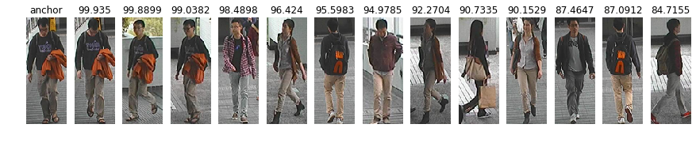

# PersonNet

[사람 재인식을 위한 개선된 PersonNet](https://www.kci.go.kr/kciportal/ci/sereArticleSearch/ciSereArtiView.kci?sereArticleSearchBean.artiId=ART002546031) 논문의 코드

## Environment
* python = 3.5   
* tensorflow = 1.x

## Test Result

  

   
